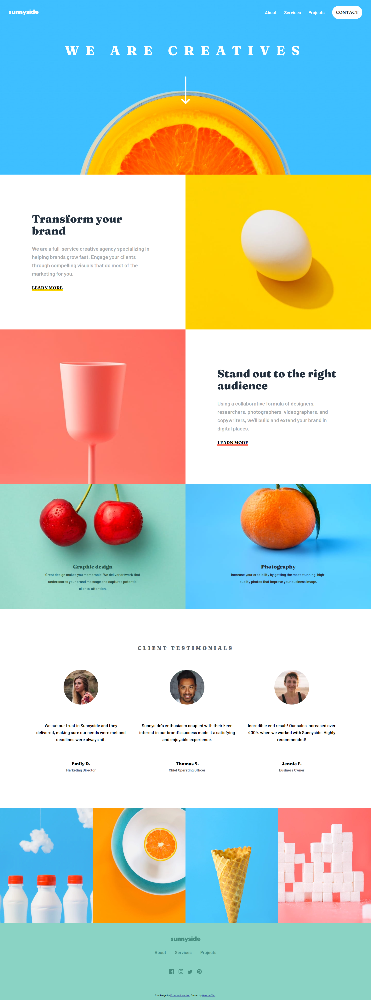
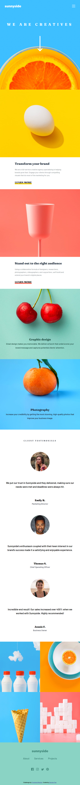

# Frontend Mentor - Sunnyside agency landing page solution

This is a solution to the [Sunnyside agency landing page challenge on Frontend Mentor](https://www.frontendmentor.io/challenges/sunnyside-agency-landing-page-7yVs3B6ef). Frontend Mentor challenges help you improve your coding skills by building realistic projects.

## Table of contents

- [Overview](#overview)
  - [The challenge](#the-challenge)
  - [Screenshot](#screenshot)
  - [Links](#links)
- [My process](#my-process)
  - [Built with](#built-with)
  - [What I learned](#what-i-learned)
  - [Continued development](#continued-development)
  - [Useful resources](#useful-resources)
- [Author](#author)

## Overview

### The challenge

Users should be able to:

- View the optimal layout for the site depending on their device's screen size
- See hover states for all interactive elements on the page

### Screenshot




### Links

- Solution URL: [Github Repo](https://github.com/Georgetxm/sunnyside-agency/tree/master)
- Live Site URL: [Vercel App](https://sunnyside-agency-i3d12cbca-georgetxm.vercel.app/)

## My process

### Built with

- Semantic HTML5 markup
- CSS custom properties
- Flexbox
- CSS Grid
- Mobile-first workflow
- JavaScript


### What I learned

Utilising CSS Grid's "grid-template-area" to create dynamic layouts.

```css
.about { 
  display: grid;
  grid-template-areas:
    "transform-image",
    "..."
}

.about__items:nth-child(1) {
  grid-area: transform-image;
}
...
.about__items:nth-child(6) {
  grid-area: photography;
}

```

Combining JavaScript and CSS's custom data attribute to create the navigation bar.

```css
.primary-navigation[data-visible="true"] {
  display: block;
  position: absolute;
  "..."
}
```

```js
navToggle.addEventListener("click", () => {
  const visibility = primaryNav.getAttribute("data-visible");
  if (visibility === "false") {
    primaryNav.setAttribute("data-visible", true);
    navToggle.setAttribute("aria-expanded", true);
  } else {
    primaryNav.setAttribute("data-visible", false);
    navToggle.setAttribute("aria-expanded", false);
  }
});
```

Custom root properties, and utilising it to create responsive text sizes.

```css
:root {
  --fs-header-title: 2em;
  "..."
  --fs-social-icons: 1.5em;
}
```

```css
@media (min-width: 16em) {
  :root {
    --fs-header-title: 1.5em;
    "..."
    --fs-social-icons: 1em;
  }
}
```

```css
@media (min-width: 80em) {
  :root {
    --fs-header-title: 3em;
    "..."
    --fs-social-icons: 2em;
  }
}
```

### Continued development

Moving forward, I'll implement a mobile-first workflow as a practice I've learned in this project that greatly reduced my CSS code. I'll also be heavily utilising CSS Grids with media queries to create layouts as they've allowed even items within a layout to be completely re-arranged at different screen sizes.


### Useful resources

- [Learn CSS Grid the easy way - Norman Powell](https://www.youtube.com/watch?v=rg7Fvvl3taU) - This helped me understand CSS Grids
- [CSS Breakpoints](https://www.freecodecamp.org/news/the-100-correct-way-to-do-css-breakpoints-88d6a5ba1862/) - This is an amazing article elaborates on the common breakpoints to use based on analysis of the width of common devices.

## Author

- LinkedIn - [George Teo Xuan Ming](https://www.linkedin.com/in/georgetxm/?originalSubdomain=sg)
- Frontend Mentor - [@Georgetxm](https://www.frontendmentor.io/profile/Georgetxm)
